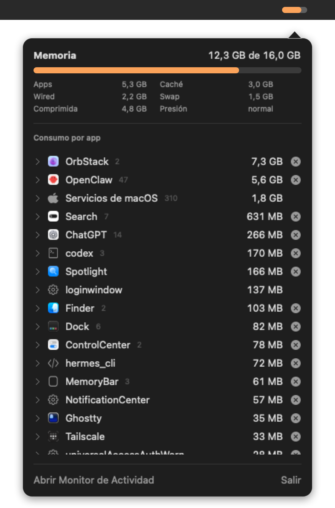

# memory-bar

A macOS menu bar app that shows memory usage grouped by the app that actually owns it.



`top` and `htop` list processes one by one, so an app split into dozens of helpers (Chrome, Slack, Electron apps, Docker VMs) is hard to account for. memory-bar adds up every process an app owns and shows one line per app.

## What it shows

- **Menu bar:** a rounded bar filled by memory used. It is neutral below 60%, turns orange towards 80% and red towards 95%. Hover for the exact figure.
- **Panel:** memory used, app/wired/compressed/cached memory, swap and memory pressure, followed by apps sorted by memory. Expand an app to see its processes.
- **Closing:** each app and process has a close button with an inline confirmation. Apps quit normally (as with ⌘Q); other processes receive `SIGTERM`. Confirming again on something still running forces it with `SIGKILL`. Processes owned by root or other users cannot be closed and show no button.

## How processes are grouped

1. A process inside an `.app` bundle belongs to the outermost bundle (Chrome renderers belong to Google Chrome).
2. A process launched by an app belongs to that app.
3. A process launched from a terminal is named after the command that was run (`claude`, `codex`, a Python module).
4. A background tool is named after what it runs (`node …/node_modules/openclaw/…` → `openclaw`) and joins an installed app with the same name.
5. macOS services launched on behalf of an app are attributed to it (WebKit content processes); the rest are grouped as macOS services.

Memory is the physical footprint, the figure Activity Monitor shows. macOS only exposes it for your own processes; for others the resident size from `ps` is used.

## Requirements

- macOS 13 or later on Apple silicon
- Xcode Command Line Tools (`xcode-select --install`); Xcode is not required

## Build and install

```sh
./build.sh
open ~/Applications/MemoryBar.app
```

`build.sh` compiles the sources, ad-hoc signs the bundle and installs it in `~/Applications`. To start it at login, add it in System Settings → General → Login Items.

To print the data from a terminal:

```sh
~/Applications/MemoryBar.app/Contents/MacOS/MemoryBar --dump
```

## Notes

- Attributing system services to apps uses `responsibility_get_pid_responsible_for_pid`, a private libsystem function that Activity Monitor also relies on. If it is unavailable, those services stay in the macOS services group.
- Memory inside a virtual machine (OrbStack, Docker Desktop) is reported for the VM as a whole; use `docker stats` for per-container figures.
